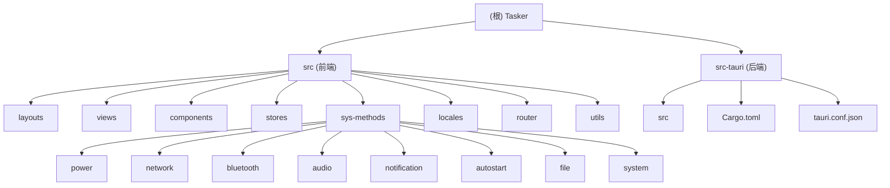

# Tasker - 现代化跨平台桌面应用模板

## 变更记录 (Changelog)

### 2026-01-15 17:16:11
- 初始化 AI 上下文文档
- 完成项目架构扫描与分析
- 生成根级和模块级文档

---

## 项目愿景

Tasker 是一个专为小白和全栈开发者设计的现代化桌面应用模板。基于 Tauri 2.0（高性能、小体积）、Vue 3（易上手的前端框架）和 Naive UI（高颜值组件库）构建，旨在提供一个开箱即用的跨平台桌面应用开发解决方案。

**核心目标**：
- 提供完整的桌面应用开发模板
- 封装常用的系统级功能（电源、网络、蓝牙、音频等）
- 支持多语言、多主题、多布局
- 简化前后端对接流程

---

## 架构总览

本项目采用前后端分离架构：
- **前端**：Vue 3 + TypeScript + Vite + Naive UI + UnoCSS
- **后端**：Tauri 2.0 (Rust) 提供系统级能力
- **状态管理**：Pinia
- **路由**：Vue Router
- **国际化**：Vue I18n
- **网络请求**：Axios

**技术栈版本**：
- Node.js: 推荐 v18/v20 LTS
- Rust: 最新稳定版
- Vue: 3.5.13
- Tauri: 2.x
- TypeScript: 5.9.3

---

## 模块结构图



---

## 模块索引

| 模块名称 | 路径 | 语言/框架 | 职责描述 |
|---------|------|----------|---------|
| **前端应用** | `src/` | Vue 3 + TypeScript | 用户界面、交互逻辑、状态管理、路由控制 |
| **后端服务** | `src-tauri/` | Rust + Tauri 2.0 | 系统级能力、原生功能、插件集成 |
| **布局系统** | `src/layouts/` | Vue 3 | 侧边栏布局、顶部菜单布局 |
| **页面视图** | `src/views/` | Vue 3 | 首页、测试页面（Axios、通知、Pinia、系统方法） |
| **公共组件** | `src/components/` | Vue 3 | 语言切换器、布局切换器、用户资料 |
| **状态管理** | `src/stores/` | Pinia | 主题状态、布局状态 |
| **系统方法** | `src/sys-methods/` | TypeScript | 电源、网络、蓝牙、音频、通知、自启动、文件、系统信息 |
| **国际化** | `src/locales/` | TypeScript | 中英文语言包 |
| **路由配置** | `src/router/` | Vue Router | 路由定义与导航守卫 |
| **工具函数** | `src/utils/` | TypeScript | Axios 封装、请求拦截器 |

---

## 运行与开发

### 环境要求

- **Node.js**: v18 或 v20 LTS
- **Rust**: 最新稳定版（通过 rustup 安装）
- **包管理器**: pnpm（推荐）

### 安装依赖

```bash
pnpm install
```

### 开发模式

启动开发服务器（前端热更新 + Tauri 窗口）：

```bash
pnpm tauri dev
```

- 前端开发服务器：http://localhost:1420
- HMR 端口：1421

### 构建打包

```bash
pnpm tauri build
```

**输出位置**：
- macOS: `src-tauri/target/release/bundle/dmg/`
- Windows: `src-tauri/target/release/bundle/nsis/`

### 脚本说明

| 命令 | 说明 |
|-----|------|
| `pnpm dev` | 仅启动前端开发服务器 |
| `pnpm build` | 构建前端生产版本 |
| `pnpm build:test` | 构建测试环境版本 |
| `pnpm preview` | 预览生产构建 |
| `pnpm tauri` | Tauri CLI 命令入口 |

---

## 测试策略

### 当前测试覆盖

项目目前主要通过**功能测试页面**进行手动测试：

1. **Axios 测试** (`/test/axios`)：测试网络请求、拦截器
2. **通知测试** (`/test/notification`)：测试系统通知权限与发送
3. **Pinia 测试** (`/test/pinia`)：测试状态管理
4. **系统方法测试** (`/test/sys-methods`)：测试电源、网络、蓝牙等系统功能

### 测试建议

- **单元测试**：建议使用 Vitest 为工具函数和组件编写单元测试
- **E2E 测试**：建议使用 Playwright 或 Tauri 官方测试工具
- **系统功能测试**：需要在实际打包后的应用中测试（开发模式权限受限）

---

## 编码规范

### TypeScript 规范

- 启用严格模式 (`strict: true`)
- 禁止未使用的变量和参数
- 使用 `@/` 别名引用 `src/` 目录
- 优先使用 Composition API

### Vue 规范

- 使用 `<script setup lang="ts">` 语法
- 组件命名采用 PascalCase
- Props 和 Emits 必须定义类型
- 优先使用组合式函数（Composables）

### Rust 规范

- 遵循 Rust 官方编码规范
- 使用 `cargo fmt` 格式化代码
- 使用 `cargo clippy` 进行代码检查

### 提交规范

建议使用约定式提交（Conventional Commits）：
- `feat:` 新功能
- `fix:` 修复 bug
- `docs:` 文档更新
- `style:` 代码格式调整
- `refactor:` 重构
- `test:` 测试相关
- `chore:` 构建/工具链相关

---

## AI 使用指引

### 项目特点

1. **双语言架构**：前端 TypeScript + 后端 Rust
2. **系统级能力**：通过 Tauri 插件和 Shell 命令实现
3. **跨平台兼容**：需要考虑 macOS 和 Windows 的差异

### 常见任务

#### 添加新页面

1. 在 `src/views/` 创建 Vue 组件
2. 在 `src/router/index.ts` 添加路由
3. 在 `src/locales/` 添加多语言文本
4. 在布局组件中添加菜单项

#### 添加系统功能

1. 在 `src/sys-methods/` 对应模块添加方法
2. 使用 `@tauri-apps/plugin-shell` 的 `Command` API
3. 使用 `@tauri-apps/plugin-os` 的 `platform()` 判断系统
4. 在测试页面验证功能

#### 添加 Tauri 插件

1. 在 `src-tauri/Cargo.toml` 添加依赖
2. 在 `src-tauri/src/lib.rs` 注册插件
3. 在前端安装对应的 npm 包
4. 在 TypeScript 中调用插件 API

#### 修改主题样式

1. UnoCSS 配置：`uno.config.ts`
2. Naive UI 主题：通过 `darkTheme` 切换
3. 自定义样式：在组件中使用 UnoCSS 原子类

### 注意事项

- **权限问题**：系统级操作（关机、WiFi 控制）需要管理员权限
- **平台差异**：命令和路径在 macOS 和 Windows 上可能不同
- **开发限制**：某些功能在开发模式下可能受限，需打包测试
- **网络配置**：Rust 依赖下载可能需要配置镜像源（已配置中科大镜像）

### 推荐工作流

1. 使用 `pnpm tauri dev` 进行开发
2. 修改前端代码会自动热更新
3. 修改 Rust 代码需要重启开发服务器
4. 定期使用 `pnpm tauri build` 验证打包

---

## 相关资源

- [Tauri 官方文档](https://tauri.app/)
- [Vue 3 官方文档](https://cn.vuejs.org/)
- [Naive UI 组件库](https://www.naiveui.com/)
- [UnoCSS 文档](https://unocss.dev/)
- [Pinia 状态管理](https://pinia.vuejs.org/)
